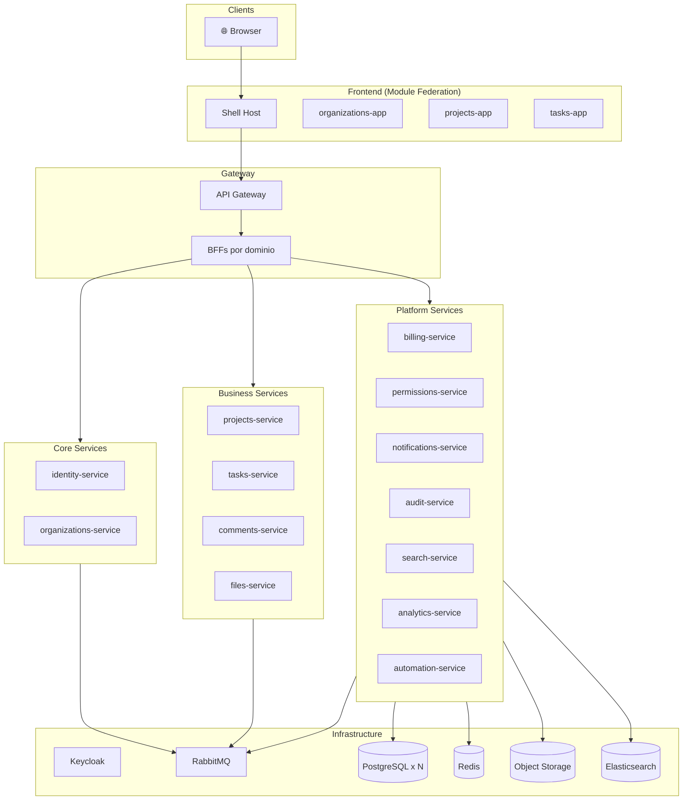

# 📚 Plan SaaS 24 Semanas - Índice de Documentación

> **Protocolo**: FCM Standard (Diagnóstico antes de Prescripción)
>
> Cada semana tiene: **Análisis** → **Propuesta** → **Tareas**

---

## 📅 Fases del Proyecto

### Fase 1: Fundación (Semanas 1-4)

| Semana | Tema                      | Análisis                | Propuesta                | Tareas               |
| ------ | ------------------------- | ----------------------- | ------------------------ | -------------------- |
| 01     | Multi-Tenant Foundation   | [📄](analysis/week-01/) | [📄](proposals/week-01/) | [📄](tasks/week-01/) |
| 02     | Tenant Context & Permisos | [📄](analysis/week-02/) | [📄](proposals/week-02/) | [📄](tasks/week-02/) |
| 03     | Projects Service          | [📄](analysis/week-03/) | [📄](proposals/week-03/) | [📄](tasks/week-03/) |
| 04     | Tasks + Saga Pattern      | [📄](analysis/week-04/) | [📄](proposals/week-04/) | [📄](tasks/week-04/) |

### Fase 2: Colaboración (Semanas 5-8)

| Semana | Tema                     | Análisis                | Propuesta                | Tareas               |
| ------ | ------------------------ | ----------------------- | ------------------------ | -------------------- |
| 05     | Notificaciones Real-Time | [📄](analysis/week-05/) | [📄](proposals/week-05/) | [📄](tasks/week-05/) |
| 06     | Audit Logs (Compliance)  | [📄](analysis/week-06/) | [📄](proposals/week-06/) | [📄](tasks/week-06/) |
| 07     | Billing & Planes         | [📄](analysis/week-07/) | [📄](proposals/week-07/) | [📄](tasks/week-07/) |
| 08     | Observabilidad (Tracing) | [📄](analysis/week-08/) | [📄](proposals/week-08/) | [📄](tasks/week-08/) |

### Fase 3: Resiliencia (Semanas 9-12)

| Semana | Tema                          | Análisis                | Propuesta                | Tareas               |
| ------ | ----------------------------- | ----------------------- | ------------------------ | -------------------- |
| 09     | Resiliencia (Circuit Breaker) | [📄](analysis/week-09/) | [📄](proposals/week-09/) | [📄](tasks/week-09/) |
| 10     | Kubernetes + Helm             | [📄](analysis/week-10/) | [📄](proposals/week-10/) | [📄](tasks/week-10/) |
| 11     | CI/CD + GitOps (ArgoCD)       | [📄](analysis/week-11/) | [📄](proposals/week-11/) | [📄](tasks/week-11/) |
| 12     | RBAC por Recurso              | [📄](analysis/week-12/) | [📄](proposals/week-12/) | [📄](tasks/week-12/) |

### Fase 4: Escala (Semanas 13-16)

| Semana | Tema                            | Docs                    |
| ------ | ------------------------------- | ----------------------- |
| 13     | Búsqueda Global (Elasticsearch) | [📄](analysis/week-13/) |
| 14     | Analytics (Event Warehouse)     | [📄](analysis/week-14/) |
| 15     | Comentarios & Threads           | [📄](analysis/week-15/) |
| 16     | Adjuntos (Object Storage)       | [📄](analysis/week-16/) |

### Fase 5: Crecimiento (Semanas 17-20)

| Semana | Tema                         | Docs                    |
| ------ | ---------------------------- | ----------------------- |
| 17     | Invitaciones Externas        | [📄](analysis/week-17/) |
| 18     | Automatizaciones (Workflows) | [📄](analysis/week-18/) |
| 19     | Rate Limiting por Tenant     | [📄](analysis/week-19/) |
| 20     | Caching Distribuido          | [📄](analysis/week-20/) |

### Fase 6: Producción (Semanas 21-24)

| Semana | Tema                        | Docs                    |
| ------ | --------------------------- | ----------------------- |
| 21     | Migraciones sin Downtime    | [📄](analysis/week-21/) |
| 22     | Hardening Seguridad         | [📄](analysis/week-22/) |
| 23     | Backups & Disaster Recovery | [📄](analysis/week-23/) |
| 24     | Lanzamiento & Operación     | [📄](analysis/week-24/) |

---

## 🏗️ Arquitectura General

---

## 📋 Slices del Sistema

| Slice         | Backend | DB         | Frontend | BFF |
| ------------- | ------- | ---------- | -------- | --- |
| Identity      | ✅      | ✅         | -        | ✅  |
| Organizations | ✅      | ✅         | ✅       | ✅  |
| Projects      | ✅      | ✅         | ✅       | ✅  |
| Tasks         | ✅      | ✅         | ✅       | ✅  |
| Notifications | ✅      | ✅         | ✅       | ✅  |
| Audit         | ✅      | ✅         | ✅       | ✅  |
| Billing       | ✅      | ✅         | ✅       | ✅  |
| Permissions   | ✅      | ✅         | ✅       | ✅  |
| Search        | ✅      | Elastic    | ✅       | ✅  |
| Analytics     | ✅      | ClickHouse | ✅       | ✅  |
| Comments      | ✅      | ✅         | ✅       | ✅  |
| Files         | ✅      | ✅ + S3    | ✅       | ✅  |
| Invitations   | ✅      | ✅         | ✅       | ✅  |
| Automation    | ✅      | ✅         | ✅       | ✅  |
