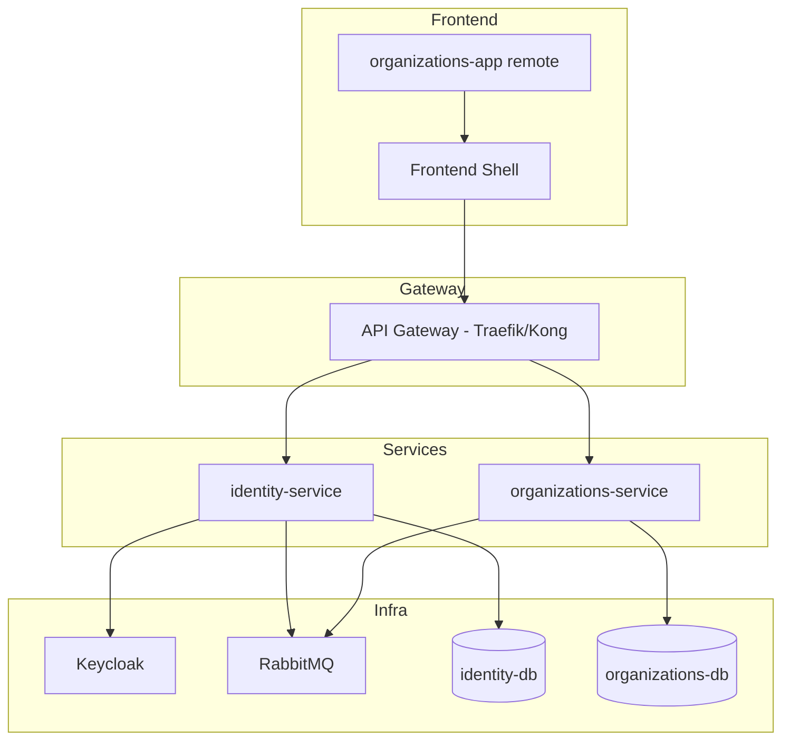

# Propuesta de Solución: Fundación Multi-Tenant

## 1. 🎯 Objetivo

Poder abrir la URL del producto y ver una aplicación SaaS corriendo en Kubernetes donde:

- Existe un Workspace (tenant)
- Existe un usuario autenticado
- El sistema reconoce a qué workspace pertenece
- El frontend muestra: "Estás dentro del workspace ACME"

## 2. 💡 Solución Técnica

### Arquitectura



### Infraestructura (docker-compose)

| Servicio              | Puerto     | Descripción               |
| --------------------- | ---------- | ------------------------- |
| Keycloak              | 8080       | IdP externo               |
| PostgreSQL (identity) | 5432       | DB identity-service       |
| PostgreSQL (orgs)     | 5433       | DB organizations-service  |
| RabbitMQ              | 5672/15672 | Message broker            |
| API Gateway           | 80         | Routing + JWT propagation |
| identity-service      | 3001       | Federación Keycloak       |
| organizations-service | 3002       | Gestión workspaces        |
| frontend-shell        | 3000       | React + Module Federation |

### Eventos del Sistema

| Evento                   | Emisor                | Consumidor              | Payload                        |
| ------------------------ | --------------------- | ----------------------- | ------------------------------ |
| `UserRegistered`         | identity-service      | organizations-service   | `{userId, email}`              |
| `WorkspaceCreated`       | organizations-service | audit, billing (futuro) | `{workspaceId, name, ownerId}` |
| `MemberAddedToWorkspace` | organizations-service | identity-service        | `{workspaceId, userId, role}`  |

### APIs

#### identity-service

```
GET /me
Response:
  userId: string
  email: string
  workspaces: [{id, name, role}]
  activeWorkspaceId: string
```

#### organizations-service

```
POST /workspaces
Body: {name: string}

GET /workspaces
Response: [{id, name, createdAt}]

POST /workspaces/{id}/members
Body: {userId: string, role: string}
```

### Alternativas Descartadas

| Alternativa            | Razón de descarte                         |
| ---------------------- | ----------------------------------------- |
| Usuarios en nuestra DB | Viola separación de concerns, duplicación |
| Monolito inicial       | No enseña arquitectura real               |
| JWT sin Keycloak       | Inseguro para producción                  |

## 3. 🛡️ Plan de Riesgos/Validación

### Riesgos

- Keycloak mal configurado → Login falla
- Base de datos compartida → Violación de arquitectura
- JWT no propagado → 401 en servicios

### Validación

1. Borrar TODAS las DBs
2. Ejecutar `docker compose up`
3. Hacer login
4. Crear workspace
5. Verificar que funciona sin tocar código
