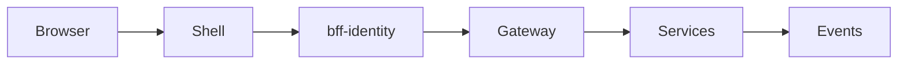

# Propuesta: Contexto de Tenant y Permisos Reales

## 1. 🎯 Objetivo

Un mismo usuario puede pertenecer a dos workspaces distintos y el sistema cambia completamente de contexto sin relogin.

**Validación esperada:**

- Crear workspace ACME
- Crear workspace Globex
- Cambiar entre ellos desde la UI
- Ver datos distintos según el workspace

## 2. 💡 Solución Técnica

### Nueva Regla del Sistema

> **TODA request debe llevar: `X-Workspace-Id`**
> Sin ese header → 403 Forbidden

### Arquitectura con BFF



### Nuevo Servicio: bff-identity

El frontend SOLO habla con BFFs, nunca con microservicios directamente.

### Tenant Middleware (todas las APIs)

```python
# Cada microservicio debe:
1. Leer X-Workspace-Id del header
2. Validar membresía (cache en Redis)
3. Inyectar tenant en request context
4. Filtrar TODAS las queries por workspace_id
```

### Cambio en Base de Datos

**TODAS las tablas** ahora deben tener:

```sql
workspace_id UUID NOT NULL,
INDEX idx_workspace_id (workspace_id)
```

### Eventos Nuevos

| Evento                    | Emisor        | Descripción                        |
| ------------------------- | ------------- | ---------------------------------- |
| `UserAddedToWorkspace`    | organizations | Usuario agregado a workspace       |
| `WorkspaceContextChanged` | BFF           | Usuario cambió de workspace activo |

### Cambios en GET /me

```json
// ANTES
{
  "userId": "...",
  "activeWorkspaceId": "..."
}

// DESPUÉS
{
  "userId": "...",
  "email": "...",
  "memberships": [
    { "workspaceId": "acme", "role": "admin" },
    { "workspaceId": "globex", "role": "viewer" }
  ]
}
```

## 3. 🛡️ Plan de Riesgos/Validación

### Prueba de Seguridad Crítica

```bash
# Modificar manualmente el header:
X-Workspace-Id: workspace_al_que_NO_perteneces

# El sistema debe responder:
403 Forbidden
```

Si responde 200 → **vulnerabilidad crítica multi-tenant**.
