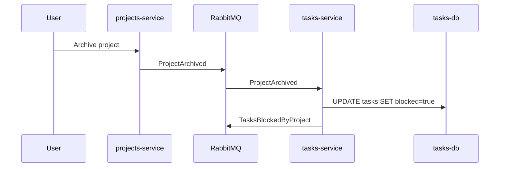

# Propuesta: Tasks + Saga Pattern

## 1. 🎯 Objetivo

Dentro de un proyecto el usuario puede crear tareas con las reglas:

- Una task no puede existir sin proyecto
- Si el proyecto se archiva → sus tasks deben bloquearse

## 2. 💡 Solución Técnica

### Modelo de Datos

```sql
-- Tabla principal
CREATE TABLE tasks (
    id UUID PRIMARY KEY,
    workspace_id UUID NOT NULL,
    project_id UUID NOT NULL,
    title VARCHAR(255) NOT NULL,
    status VARCHAR(20) DEFAULT 'todo', -- todo | doing | done
    created_by UUID NOT NULL,
    created_at TIMESTAMP DEFAULT NOW(),
    blocked BOOLEAN DEFAULT FALSE
);

-- Proyección local de projects (cache)
CREATE TABLE projects_cache (
    project_id UUID PRIMARY KEY,
    workspace_id UUID NOT NULL,
    archived BOOLEAN DEFAULT FALSE,
    last_synced TIMESTAMP
);
```

### Eventos

| Consume       | Evento            | Acción                                     |
| ------------- | ----------------- | ------------------------------------------ |
| tasks-service | `ProjectCreated`  | Insertar en projects_cache                 |
| tasks-service | `ProjectArchived` | Update archived=true, marcar tasks blocked |

| Emite         | Evento                  | Payload                          |
| ------------- | ----------------------- | -------------------------------- |
| tasks-service | `TaskCreated`           | `{taskId, projectId, title}`     |
| tasks-service | `TaskStatusChanged`     | `{taskId, oldStatus, newStatus}` |
| tasks-service | `TasksBlockedByProject` | `{projectId, taskIds[]}`         |

### Validación al Crear Task

```python
def create_task(project_id, title):
    project = projects_cache.get(project_id)
    if not project:
        raise 409("Project not found - eventual consistency")
    if project.archived:
        raise 409("Project is archived")
    return Task.create(project_id, title)
```

### Saga: Archivar Proyecto



## 3. 🛡️ Plan de Riesgos/Validación

### Prueba de Consistencia Eventual

1. Detener tasks-service
2. Crear proyecto en projects-service
3. Iniciar tasks-service
4. Verificar: proyectos se sincronizan por eventos
5. Ahora se pueden crear tasks
