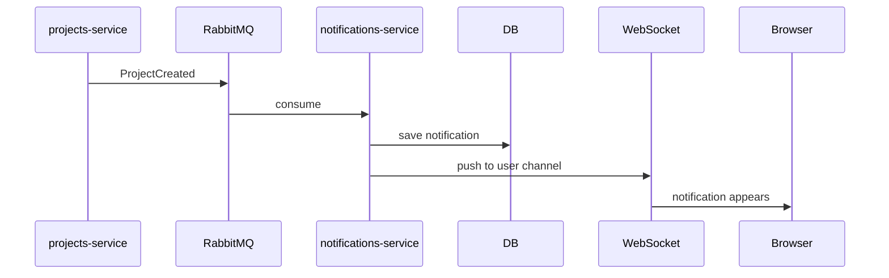

# Propuesta: Notificaciones en Tiempo Real

## 1. 🎯 Objetivo

Cuando ocurre algo en el workspace, otros usuarios lo ven sin refrescar:

- Alguien crea proyecto → aparece notificación
- Alguien crea task → aparece notificación
- Proyecto archivado → alerta inmediata

## 2. 💡 Solución Técnica

### Modelo de Datos

```sql
CREATE TABLE notifications (
    id UUID PRIMARY KEY,
    workspace_id UUID NOT NULL,
    user_id UUID NOT NULL,
    type VARCHAR(50) NOT NULL,
    title VARCHAR(255),
    payload JSONB,
    read BOOLEAN DEFAULT FALSE,
    created_at TIMESTAMP DEFAULT NOW()
);
```

### APIs

| Método | Ruta                          | Descripción           |
| ------ | ----------------------------- | --------------------- |
| GET    | `/notifications`              | Listar notificaciones |
| PATCH  | `/notifications/{id}/read`    | Marcar como leída     |
| GET    | `/notifications/unread-count` | Contador no leídas    |

### WebSocket

Canal por `user_id`. El WebSocket es directo desde browser a notifications-service (no pasa por Gateway HTTP).

### Flujo



## 3. 🛡️ Validación

### Prueba Catch-up

1. Apagar notifications-service
2. Crear proyectos y tasks
3. Encender notifications-service
4. Verificar: notificaciones atrasadas aparecen
